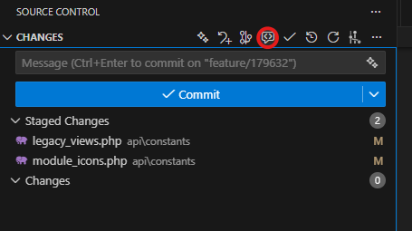

# Instrukcje dla Developerów - MintHCM

## 🚀 Flow Implementacji z Copilot Instructions

### 1. Praca z Agentem Copilot

Podczas implementacji przekazuj polecenia Copilotowi w trybie agenta, rozbijając User Story na mniejsze części:

- Dodanie pojedynczego pola
- Utworzenie nowego modułu
- Implementacja konkretnej funkcjonalności
- Realizacja wycinka User Story

**💡 Rekomendowany model:** **Grok Code Fast 1** (nie zużywa limitu premium requestów)

### 2. Nakierowanie na Standardy

Podczas wykonywania zadań przez Copilota:

- Informuj go o naszych standardach kodowania
- Wskazuj, co należy dodać lub poprawić
- Upewnij się, że realizacja odpowiada naszym wymaganiom
- Odwołuj się do instrukcji w `.github/copilot-instructions.md` i `.github/instructions/`

### 3. Aktualizacja Instrukcji

Po zakończeniu developmentu wykonaj aktualizację instrukcji:

```
/updateInstructions
```

**🎯 Użyj lepszego modelu:** Claude Sonnet 4.5

Ta komenda spowoduje:
- Zaktualizowanie copilot instructions na podstawie historii konwersacji
- Aktualizację dokumentacji projektu

### 4. Code Review - Uncommited Changes

Po zakończonej implementacji wykonaj akcję **"Code Review - Uncommited changes"**:



Copilot:
- Wyświetli interfejs z propozycjami poprawek
- Pozwoli od razu odrzucić lub zaakceptować zmiany
- Zweryfikuje kod na podstawie naszych instrukcji

### 5. Finalizacja

- Commituj zadanie zgodnie ze standardami
- Commituj zmiany w copilot instructions (jeśli były aktualizacje)

---

## 🔍 Flow Code Review (CR-ek)

### Krok 1: Przygotowanie

Skopiuj hash commita, który wymaga code review.

### Krok 2: Analiza z Copilotem

W Copilot Chat wykonaj:

```
Wykonaj code review commita: [hash-commita]
```

### Krok 3: Code Review

- Przeprowadź CR jak dotychczas, wspierając się podpowiedziami od Copilota
- Zwracaj uwagę na zgodność ze standardami w `.github/copilot-instructions.md`
- Jeśli znajdziesz nieprawidłowości w instrukcjach, zaktualizuj je

### Krok 4: Aktualizacja Instructions

Poproś Copilot Chat o wprowadzenie zmian w copilot instructions:

```
Na podstawie znalezionych problemów, zaktualizuj copilot instructions aby uniknąć takich błędów w przyszłości
```

---

## 📁 Struktura Repozytorium

Instrukcje i prompty dla Copilota znajdują się w katalogu `.github/`:

```
.github/
├── copilot-instructions.md      # Główny plik z instrukcjami
│                                 # Zasady tworzenia kodu (backend/frontend)
│                                 # Konwencje syntaxu i nazewnictwa
│
├── instructions/                 # Szczegółowe instrukcje tematyczne
│   └── ...
└── prompts/                      # Pliki z promptami dla Copilot
    └── ...
```

---

## 💡 Wskazówki do Instructions i Prompts

### Wykorzystanie DBCode

Jeśli potrzebujesz informacji o strukturze bazy danych:

- Użyj rozszerzenia DBCode w VS Code
- Wskaż bazę danych, z której Copilot ma pobierać strukturę
- Copilot będzie miał dostęp do aktualnego schematu tabel

### Najlepsze Praktyki

1. **Bądź konkretny** - Im bardziej szczegółowe instrukcje, tym lepsze wyniki
2. **Podawaj przykłady** - Przykłady kodu w instructions pomagają Copilotowi zrozumieć oczekiwania
3. **Aktualizuj regularnie** - Po każdej implementacji i Code Review aktualizuj instructions

---

## 📚 Dokumentacja Copilot i VS Code

### Oficjalne źródła:

**Copilot Instructions:**
- [Dodawanie instrukcji do repozytorium](https://docs.github.com/en/copilot/how-tos/configure-custom-instructions/add-repository-instructions?tool=vscode)
- [Custom Instructions w VS Code](https://code.visualstudio.com/docs/copilot/customization/custom-instructions)

**Prompt Files:**
- [Prompt Files w VS Code](https://code.visualstudio.com/docs/copilot/customization/prompt-files)

**Code Review:**
- [Code Review z Copilot](https://docs.github.com/en/copilot/how-tos/use-copilot-agents/request-a-code-review/use-code-review)

---

## 🎯 Szybki Start

1. **Zapoznaj się z instrukcjami:**
   - Przeczytaj `.github/copilot-instructions.md`
   - Przejrzyj pliki w `.github/instructions/`

2. **Skonfiguruj środowisko:**
   - Zainstaluj rozszerzenie GitHub Copilot
   - Skonfiguruj DBCode (opcjonalnie)

3. **Rozpocznij pracę:**
   - Używaj trybu agenta dla implementacji
   - Aktualizuj instructions po każdym zadaniu
   - Przeprowadzaj Code Review z pomocą Copilota

4. **Dziel się wiedzą:**
   - Jeśli znajdziesz przydatne wzorce, dodaj je do instructions
   - Pomóż w rozwoju bazy wiedzy projektu

**Pamiętaj:** Copilot Instructions to żywy dokument. Im więcej z niego korzystamy i go rozwijamy, tym lepsze wyniki osiągamy! 🚀
