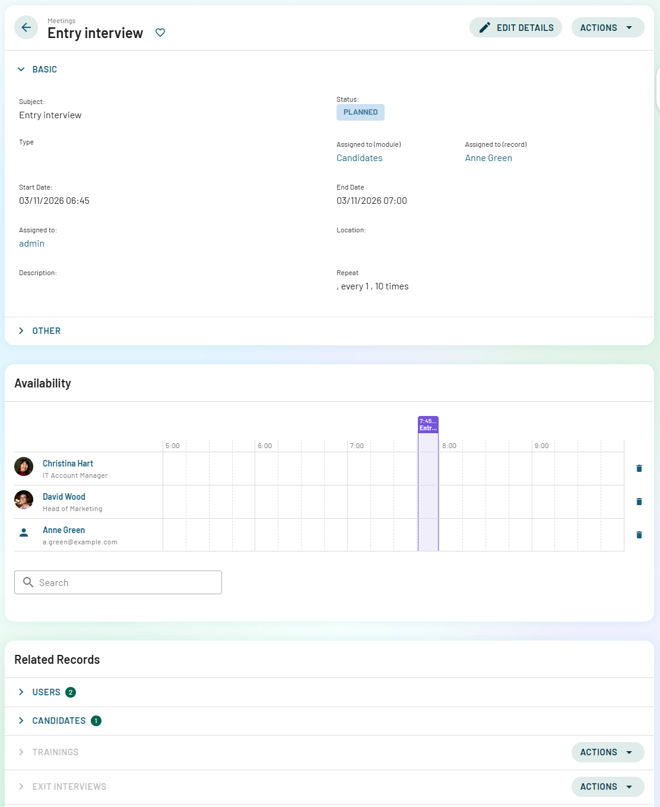

#  MintHCM 4.3 Release Notes

## Table of Contents

- [System Requirements](#system-requirements)
- [Features - Major Changes](#-features---major-changes)
  - [OAuth2 - New Authorization System](#oauth2---new-authorization-system)
  - [MintMCP - Model Context Protocol](#mintmcp---model-context-protocol)
  - [RecordView - New Unified Record View](#recordview---new-unified-record-view)
  - [MintLogic - Dynamic Form Logic System](#mintlogic---dynamic-form-logic-system)
  - [Entities/ORM - Doctrine Integration](#entitiesorm---doctrine-integration)
  - [UnifiedSearchView - Global Search Interface](#unifiedsearchview---global-search-interface)
  - [ListView Improvements](#listview-improvements)
  - [User Experience Improvements](#user-experience-improvements)
  - [Technical Documentation](#technical-documentation)
- [Bugfixes](#-bugfixes)
- [Security Patches](#-security-patches)
- [Upgrade Instructions](#upgrade-instructions-minthcm-42---minthcm-43)

---

## System Requirements

| Component | Version |
|-----------|--------|
| **PHP** | 8.2 |
| **MySQL** | 8.0 (or MariaDB 10.5, 10.6, 10.10, 10.11) |
| **Elasticsearch** | 7.9 - 7.16 |
| **Node.js** | 21 |

---

## 📦 Features - Major Changes

### OAuth2 - New Authorization System

**Key Changes:**

- 🔐 Complete new OAuth2 implementation in `api/app/Controllers/OAuth2/`
- New grants: `FrontendGrant`, `MobileGrant`
- Token repositories: `AccessToken`, `RefreshToken`, `MintToken`
- **Private keys required**: OAuth2 private keys are now mandatory for frontend authentication
- Keys are automatically generated during fresh installation

**MintCLI Commands:**

| Command | Description |
|---------|-------------|
| `./MintCLI oauth2:create-keys` | Generate OAuth2 private/public key pair |
| `./MintCLI oauth2:regenerateClientSecret` | Regenerate OAuth2 client secret |

> **⚠️ IMPORTANT**  
> If you experience login issues after upgrade, run:
```bash
./MintCLI oauth2:create-keys
./MintCLI oauth2:regenerateClientSecret
```

---

### MintMCP - Model Context Protocol

**Implementation:**

- 🔧 New MCP server implementation with permission control
- Pagination support in MCP tools (trait `PaginationTrait`)
- Configuration with pagination limit (`max_pagination_limit`)
- Enhanced data validation with `ToolValidation`
- Date/timezone conversion utilities (`DateTimeConversion`)
- Improved error handling and structured responses

**New MCP Tools:**

| Tool | Purpose |
|------|--------|
| `ListUsers` | List system users with filtering options |
| `SearchRecords` | Search records across modules with advanced filters |
| `SumRecords` | Aggregate numeric data from records |
| `UpdateRecord` | Update existing records with validation |

---

### RecordView - New Unified Record View

> **✨ NEW FEATURE**  
> RecordView is a completely new view type designed to replace the legacy EditView and DetailView with a modern, unified interface.



**Key Features:**
- **Unified Interface**: Single view that combines both display and edit modes, eliminating the need for separate DetailView and EditView
- **Modern Architecture**: Built with Vue 3 using composables (`useBean`, `useACL`) for better code reusability and maintainability
- **Studio Support**: Full configuration through Studio interface
- **Panel-Based Layout**: Flexible panel system supporting multiple components and custom layouts
- **Subpanels Integration**: Built-in support for subpanels with pagination and ACL control
- **ACL Integration**: Comprehensive permissions checking at view, field, and action levels
- **Dynamic Title**: Browser tab title updates based on record name and module

**Migration Path:**

RecordView is intended to become the default view for all modules, gradually replacing the legacy EditView and DetailView. Modules can be configured to use RecordView through metadata configuration.

---

### MintLogic - Dynamic Form Logic System

> **✨ NEW FEATURE**  
> A powerful backend system for managing dynamic form behavior and validation without modifying frontend code.

**Key Features:**
**Capabilities:**

| Feature | Description |
|---------|------------|
| **Declarative Logic** | Define form behavior in PHP configuration files (`logicdefs.php`) |
| **Dynamic Fields** | Control visibility, required state, read-only status, and values |
| **Advanced Validation** | Field-level and bean-level validation with custom validators |
| **Formula System** | Built-in helpers: `equals()`, `notEmpty()`, `or()`, `and()` with `$fieldName` syntax |
| **Hook-Based Execution** | `INIT`, `CHANGE`, or `ALL` hooks for flexible trigger timing |
| **Dynamic Options** | Update enum field options based on conditions |
| **API Integration** | Automatic logic updates via API responses |

**Built-in Validators:**
- `IsUnique` - Ensure field value uniqueness
- `IsInRange` - Validate numeric ranges
- Module-specific validators available

**Implementation:**
- Location: `api/lib/MintLogic/`
- Module-specific logic: `api/lib/MintLogic/Modules/{ModuleName}/*logicdefs.php`
- Custom logic: `api/custom/lib/MintLogic/{ModuleName}/*logicdefs.php`
- Example modules with logic: WorkSchedules, Workplaces, Rooms, SpentTime
- BasicSet implementation

**Purpose:**

Essential component for RecordView forms, enabling complex business logic and validation without frontend modifications. Provides a maintainable, server-side approach to form behavior management.

---

### Entities/ORM - Doctrine Integration

**Enhanced ORM Layer:**

Massive expansion of Doctrine entity support across the entire system.

**Key Features:**
- **200+ Entity Files**: Added/updated entities for all modules in `api/app/Entities/`
- **Custom Fields Support**: Entities now support custom fields with automatic synchronization
  - Dynamic entity rebuilding when custom fields are added/modified via Admin > "Quick Repair and Rebuild"
  - Proper handling of custom table (CSTM) integration
- **Improved Generation**: 
  - Better entity generator with relational field support
  - Automatic constraint handling for custom entities
  - Fixed entity rebuilding issues with technical column names (e.g., "system")
  - Fixed Custom ID Generator handling in entity properties
  - Improved shouldGenerateCustomEntity validation logic
  - Better hasCustomTable() detection

**Impact:**

This provides a robust, type-safe ORM layer for API development, replacing direct database queries with proper entity management.

---

### UnifiedSearchView - Global Search Interface

> **✨ NEW FEATURE**  
> A new unified global search interface that allows users to search across all modules from a single view.

**Key Features:**
- **Cross-Module Search**: Search records across all accessible modules simultaneously
- **Advanced Query Processing**: Smart query standardization with wildcard support
- **Paginated Results**: Built-in pagination with configurable items per page
- **Module Icons**: Visual module identification in search results
- **Quick Navigation**: Direct links to record detail views from search results
- **Responsive Design**: Modern, clean interface with proper loading states

**Implementation:**
- Frontend: `vue/src/views/UnifiedSearchView/UnifiedSearchView.vue`
- API: `unifiedSearchApi.globalSearch()`
- Accessible via search bar with query parameters

---

### ListView Improvements

**Mass Actions Enhancement:**
- **Mass Update**: New capability to update multiple records at once directly from ListView
  - Select multiple records using checkboxes
  - Apply changes to selected records in bulk
  - Supports field validation and proper error handling
  - Available for modules with appropriate permissions

**Filter Operators Enhancements:**

| Operator Type | Operator | Description |
|---------------|----------|-------------|
| **New** | `parent` | Filter by parent relationship fields |
| **New** | `datetime` | Separate datetime operator (previously combined with `date`) |
| **Enhanced** | `one_of` | Filter by one of multiple related records |
| **Enhanced** | `none_of` | Exclude multiple related records |

**New Input Types:**
- `parent` input - For parent field filtering
- `multirelate` input - Multi-select for related records

**UI/UX Improvements:**
- Default list sorting with customizable sort order
- First column locking/freezing - keeps first column visible while scrolling
- Improved pagination in subpanels with configurable items per page
- Better handling of large datasets

---

### User Experience Improvements

**Navigation & Interface:**
- **Menu Management**: 
  - Collapsible/expandable menu
  - Side menu state persistence - remembers user's menu preferences
- **Timezone Support**: Enhanced time handling with proper user timezone support
  - Automatic conversion between server and user timezones
  - Consistent date/time display across the application

**Module-Specific Enhancements:**
- **Kanban View for Applications**: New kanban board visualization for Applications module
  - Drag-and-drop functionality
  - Visual pipeline management
  - Status-based columns

**Demo Data:**
- Improved demo data installation process
- Support for exporting demo data with technical field names (e.g., "system")
- New configuration file: `legacy/install/DemoDataInstallation/Configs/demo_data.php`

**Mobile Support:**
- Enhanced mobile device token tracking (ref #168518)
  - Device tokens stored with last_used timestamp
  - Automatic cleanup of stale device tokens
  - Improved token management for mobile applications

---

### Technical Documentation

**AI-Generated Documentation**: Comprehensive technical documentation for API and Vue components.

**Key Features:**
- **API Documentation**: Complete documentation for backend API endpoints, controllers, and services
  - Location: `api/documentation/`
  - Covers authentication, modules, entities, and custom endpoints
- **Vue Documentation**: Frontend component and architecture documentation
  - Location: `vue/documentation/`
  - Includes component APIs, stores, composables, and view structures
- **AI-Powered Maintenance**: Documentation is generated and maintained using AI assistance
  - Continuously updated as codebase evolves
  - Ensures accuracy and completeness
  - Living documentation that grows with the project

**Purpose:**

Provides developers with comprehensive, up-to-date technical reference for both backend and frontend development.

---

## 🐞 Bugfixes

### ListView & Filtering
- Fixed multiple data loading when entering list view
- Fixed "Email Addresses" column sorting not working
- Fixed sorting by relational field breaking the list view
- Fixed relational field filters not always working
- Fixed pencil action not redirecting to EditView
- Fixed pagination issues in Work Time view within Work Plan
- Fixed non-functional parent field on edit view
- Fixed global search relate/parent fields - display and navigation to records

---

### Subpanels
- Fixed missing data in subpanels
- Fixed subpanel loading errors
- Fixed subpanel visibility issue despite having module access 
- Fixed "Create" button in subpanels
- Fixed users not being able to see too much in subpanels
- Fixed adding Contracts through subpanel not working

---

### RecordView & Forms
- Fixed Date field clearing itself
- Fixed missing users when duplicating meeting records
- Fixed empty fields after failed user creation attempt
- Fixed unable to create costs under Business Trip
- Fixed unable to change employee status
- Fixed multienum field issues

---

### Module-Specific Issues
- **Onboarding**: Fixed Onboarding statuses
- **Applications**: Fixed "Current Recruitment" not auto-filling
- **Allocations**: Fixed unable to add Employee to allocation 
- **Work Plan**: 
  - Fixed Work Plan Manager dashlet time logging resetting date
  - Fixed Work Plan Manager - time saving, missing labels and undefined labels
  - Fixed Work Plan approval popup - colors and design system inconsistency
- **Kudos**: 
  - Fixed not seeing some kudos in ALL tab
  - Fixed access to kudos list at ALL level
- **Dashboards**: Fixed global issue with non-working options/filters on dashlets
- **Missing Dashlet**: Fixed missing "My Worked Time" dashlet

#### Navigation & UI
- Fixed administrators having too many modules in navigation bar
- Fixed alert panel clearing when clicking "x" on alerts
- Fixed test environment lagging due to alerts

---

### Database & Technical
- Fixed database errors
- Fixed entity generation issues with technical column names (e.g., "system")
- Fixed Doctrine cache not being cleared during Quick Repair and Rebuild

---

### Dependencies Updates
**Frontend (Vue.js):**

| Package | Change | Description |
|---------|--------|-------------|
| `@vueuse/core` | `^13.0.0` → `^13.1.0` | Updated |
| `dropzone` | Added `^6.0.0-beta.2` | New dependency for file upload |
| `Node.js` | Requirement: `~21` | Previously `~16 || ~21` |
| `axios` | `^1.3.5` → `^1.12.0` | **Major update** for security and performance |
| `@vitejs/plugin-vue` | `^3.0.3` → `^6.0.1` | **Major update** |
| `vite` | `^3.0.8` → `^6.3.4` | **Major update** |
| `vite-plugin-vuetify` | `^1.0.0-alpha.12` → `^2.1.2` | **Major update** |
| `vuetify` | `npm:@vuetify/nightly@next` → `^3.11.3` | Moved from nightly to stable |
| `tinymce` | `^5.10.7` → `^7.2.0` | **Major update** |
| `md-editor-v3` | Added `^6.1.1` | New Markdown editor dependency |

**Security Overrides:**
- `cross-spawn`: `7.0.5`
- `esbuild`: `0.25.0`
- `postcss`: `8.4.31`
- `webpack-dev-server`: `5.2.1`

**Backend (PHP/Composer):**

| Package | Version | Description |
|---------|---------|-------------|
| `league/oauth2-server` | `^8.5` | OAuth2 server implementation |

---

## 🔒 Security Patches
- **CVE-2025-64490**: Security vulnerability patch
  - Enhanced authentication security in multiple areas:
    - `ParamsMiddleware.php` - Parameter validation improvements
    - `AccessTokenRepository.php` - Access token security hardening
    - `UserService.php` - User service security enhancements
    - `User.php` - User authentication security improvements
    - `SugarAuthenticateUser.php` - Authentication mechanism hardening
    - Enhanced login attempt tracking and security logging
    - Improved SOAP service security measures

---

## 📋 Upgrade Instructions (MintHCM 4.2 → MintHCM 4.3)

We recommend two approaches for upgrading to MintHCM 4.3:

### ⚙️ Option 1: In-Place Upgrade (Advanced Users)

This option updates your existing installation while preserving all customizations.

> **⚠️ PREREQUISITES**
> - ✅ Backup your database and files before starting
> - ✅ Ensure system requirements are met (PHP 8.2, MySQL 8.0, Elasticsearch 7.9-7.16, Node.js 21)

**Steps:**

1. **Update Repository**
   
   Pull the latest changes from repository or replace files manually.

2. **Update Frontend**
   
   Choose one of the following options:
   
   **Option A - Copy pre-built files:**
   ```bash
   cp vue/dist/index.html ./index.html
   ```
   
   **Option B - Build frontend yourself:**
   ```bash
   cd vue
   npm install
   npm run build && rm -r ../assets && cp -r dist/* ../
   cd ..
   ```

3. **Generate OAuth2 Keys** (Critical)
   
   Generate new OAuth2 keys for frontend authentication:
   ```bash
   ./MintCLI oauth2:create-keys
   ./MintCLI oauth2:regenerateClientSecret
   ```
   
   
   > **⚠️ CRITICAL**  
   > Without these keys, the frontend will not be able to authenticate users.

5. **Clear Browser Cache**
   
   Clear your browser cache or use hard refresh (Ctrl+F5 / Cmd+Shift+R) to ensure new assets are loaded.

6. **Login**
   
   Navigate to your MintHCM URL and log in with your credentials.

**If login issues occur:**
- Regenerate OAuth2 keys: `./MintCLI oauth2:create-keys && ./MintCLI oauth2:regenerateClientSecret`
- Check database table `oauth2clients` contains 'frontend' client record
- Verify OAuth2 key files exist in the OAuth2 keys directory (`api/configs/`)
- Clear browser cache completely
- Check browser console for authentication errors

---

### 🆕 Option 2: Fresh Installation with Database Migration (Recommended)

This option provides a cleaner upgrade path with minimal risk.

**Steps:**

1. **Fresh Installation**
   
   Install MintHCM 4.3 in a new directory following the standard installation procedure.

2. **Configure Database Connection**
   
   After installation, update the database configuration files to point to your existing database:
   
   **File 1:** `legacy/config.php`
   ```php
   $sugar_config['dbconfig']['db_host_name'] = 'your_host';
   $sugar_config['dbconfig']['db_user_name'] = 'your_user';
   $sugar_config['dbconfig']['db_password'] = 'your_password';
   $sugar_config['dbconfig']['db_name'] = 'your_database';
   ```
   
   **File 2:** `api/config/mint/config_override.php`
   ```php
   return [
       'database' => [
           'host' => 'your_host',
           'user' => 'your_user',
           'password' => 'your_password',
           'dbname' => 'your_database',
       ],
   ];
   ```

3. **Run Quick Repair and Rebuild**
   
   Navigate to:
   ```
   Admin > Repair > Quick Repair and Rebuild
   ```
   
   This will:
   - Add any missing database tables and columns
   - Update database schema for new features
   - Rebuild entity definitions
   - Generate necessary cache files

4. **Reindex Elasticsearch**
   
   After connecting to your existing database, you must reindex all data in Elasticsearch:
   ```bash
   ./MintCLI elasticsearch:reindex
   ```
   
   This command will:
   - Clear existing Elasticsearch indices
   - Reindex all modules and records
   - Ensure search functionality works correctly with your data
   
   
   > **ℹ️ NOTE**  
   > Depending on the size of your database, this process may take several minutes to complete.

5. **Verify System**
   
   - Test login functionality
   - Verify data integrity
   - Check custom modules and customizations
   - Test core functionality
   - Test search functionality

**Migration of Custom Files:**
- Copy custom modules from `custom/` directory
- Copy custom themes if any
- Migrate any custom configurations
- Test thoroughly after migration

---

## ✅ Post-Upgrade Checklist

After completing either upgrade method:

- [ ] OAuth2 keys are generated and working
- [ ] Users can log in successfully
- [ ] Frontend loads without errors
- [ ] Database connection is properly configured
- [ ] Quick Repair and Rebuild completed without errors
- [ ] Custom modules are functioning
- [ ] Core functionality tested (list views, record views, subpanels)
- [ ] Elasticsearch is indexing properly
- [ ] Scheduled jobs are configured
- [ ] Email configuration is working
- [ ] File permissions are correct
